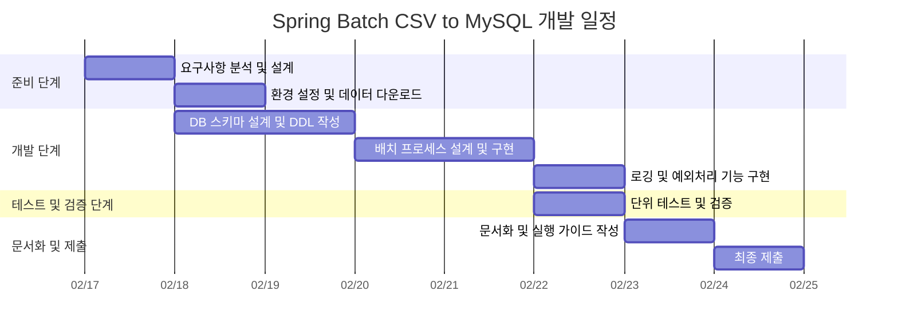

# 📌 Spring Batch CSV to MySQL (`spring-batch-csv2mysql`)

**Spring Batch 기반의 대용량 CSV 데이터를 MySQL 데이터베이스로 효율적으로 적재하는 배치 애플리케이션**

## 🛠 프로젝트 개요
본 프로젝트는 **공공데이터포털의 전국 일반 음식점 표준 데이터 (CSV)** 를 **Spring Batch** 를 활용하여 **MySQL 데이터베이스에 저장**하는 배치 애플리케이션입니다. 대량 데이터를 처리할 때 **무결성을 보장**하고, **성능 최적화**를 고려한 배치 작업을 수행합니다.

## 🚀 주요 기능
- **대용량 CSV 파일 파싱 및 MySQL 데이터베이스 저장**
- **Spring Batch 기반의 배치 작업 자동화**
- **배치 실행 과정 로깅 및 오류 추적 기능**
- **단위 테스트 및 통합 테스트 지원**
- **확장 가능하고 유지보수 가능한 아키텍처 설계**

## 📆 프로젝트 일정


## 🔧 기술 스택
- **JDK 17**
- **Spring Boot 3.x**
- **Spring Batch 5.x**
- **MySQL 8.x**
- **Gradle 8.x**
- **Lombok**
- **SLF4J + Logback (로깅)**

## 📂 프로젝트 구조
```
spring-batch-csv2mysql
│── src
│   ├── main
│   │   ├── java/com/example/batch
│   │   │   ├── config      # 배치 및 DB 설정
│   │   │   ├── domain      # Entity 클래스
│   │   │   ├── dto         # DTO 클래스
│   │   │   ├── repository  # JPA Repository
│   │   │   ├── service     # 비즈니스 로직
│   │   │   ├── job         # 배치 작업(Job, Step)
│   │   │   └── utils       # 유틸리티 클래스
│   │   ├── resources
│   │   │   ├── application.yml  # 설정 파일
│   │   │   ├── data            # CSV 파일 저장 위치
│── test
│── README.md
│── build.gradle
│── settings.gradle
│── Dockerfile (optional)
│── .gitignore
```

## ⚙️ 실행 방법
1. **CSV 데이터 다운로드 및 압축 해제**
   - [공공데이터포털 전국일반음식점표준데이터](https://www.data.go.kr/data/15096283/standard.do)에서 CSV 파일을 다운로드 후 `src/main/resources/data/`에 저장

2. **애플리케이션 실행**
   ```bash
   ./gradlew bootRun
   ```

3. **배치 실행 로그 확인**
   - `logs/batch.log` 에 배치 실행 과정 기록

## 🧪 테스트 실행
```bash
./gradlew test
```

## 📜 라이선스
본 프로젝트는 MIT 라이선스를 따릅니다.
